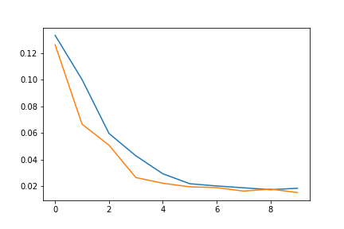

# Conclusions

All the 3 supervised learning that follows:
- Orange mission: binary classification
- Purple mission: multi-label (single class) classification
- Green mission: multi-label & multi-class classification

They have, at its core, a tensorflow-based implementation.
In fact, they both share almost the same data pipeline,
with data augmentation process, just adapted to the problem.

Besides, the backbone of the models are the same (or really 
similar in case of the CNNs built from scratch),
just adapted to the complexity of the data and the type
of classification.

### Relevant links
- [Orange mission: Kaggle notebook](https://www.kaggle.com/code/gerardcastro/eurecat-orange)
- [Purple mission: Kaggle notebook](https://www.kaggle.com/gcastro98dev/eurecat-purple)
- [Green mission: Kaggle notebook](https://www.kaggle.com/gerardcastro/eurecat-green) 

 ## CNNs built from scratch

For this mission a new CNN was used. The accuracy in train and validation
was proper; however due to the lack of time; I could not append more plots
regarding the model score. However, the model serialization is attached.

