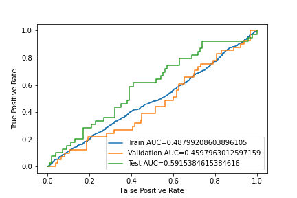

# Conclusions

All the 3 supervised learning that follows:
- Orange mission: binary classification
- Purple mission: multi-label (single class) classification
- Green mission: multi-label & multi-class classification

They have, at its core, a tensorflow-based implementation.
In fact, they both share almost the same data pipeline,
with data augmentation process, just adapted to the problem.

Besides, the backbone of the models are the same (or really 
similar in case of the CNNs built from scratch),
just adapted to the complexity of the data and the type
of classification.

### Relevant links
- [Orange mission: Kaggle notebook](https://www.kaggle.com/code/gerardcastro/eurecat-orange)
- [Purple mission: Kaggle notebook](https://www.kaggle.com/gcastro98dev/eurecat-purple)
- [Green mission: Kaggle notebook](https://www.kaggle.com/gerardcastro/eurecat-green) 

 ## Pretrained CNN: EfficientNet

After a time-consuming training with a pre-trained EfficientNet, 
the following results were sought:


It is worthwhile looking the ROC, too:


With this model, the following summary was obtained:

```text
--------- TRAIN ---------
              precision    recall  f1-score   support

           0       0.79      0.78      0.79      2112
           1       0.22      0.23      0.22       560

    accuracy                           0.66      2672
   macro avg       0.50      0.50      0.50      2672
weighted avg       0.67      0.66      0.67      2672


--------- VALIDATION ---------
              precision    recall  f1-score   support

           0       0.82      0.80      0.81       182
           1       0.20      0.22      0.21        41

    accuracy                           0.70       223
   macro avg       0.51      0.51      0.51       223
weighted avg       0.71      0.70      0.70       223


--------- TEST ---------
              precision    recall  f1-score   support

           0       0.74      0.78      0.76       100
           1       0.35      0.31      0.33        39

    accuracy                           0.65       139
   macro avg       0.55      0.54      0.54       139
weighted avg       0.63      0.65      0.64       139
```

## CNN from scratch

Below we have the confusion matrix for the CNN built from scratch:


And the ROC as well:


## Transformer

The implementation works properly; however, due to the amount of data
the results were poorer; and thus not displayed.