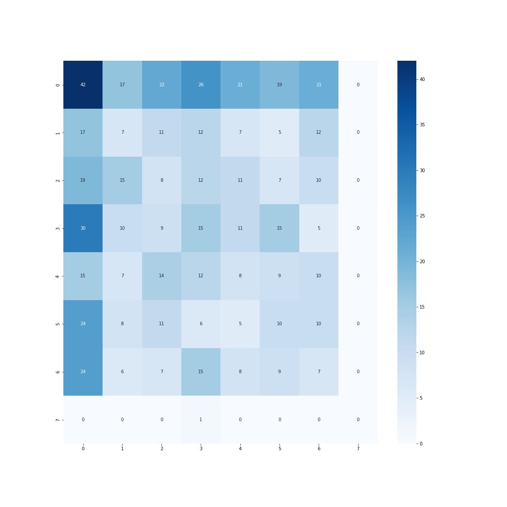
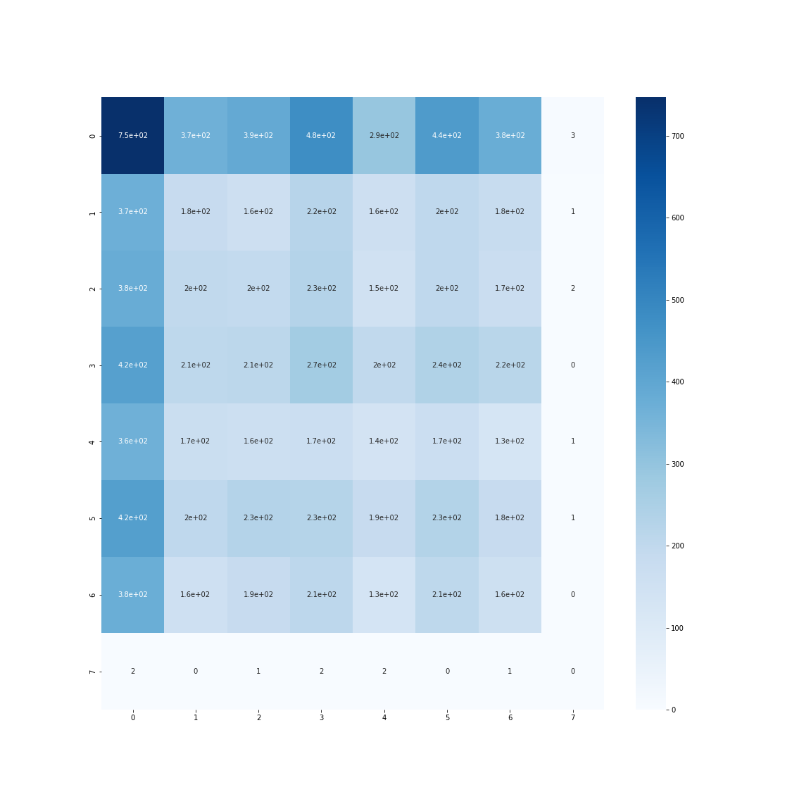
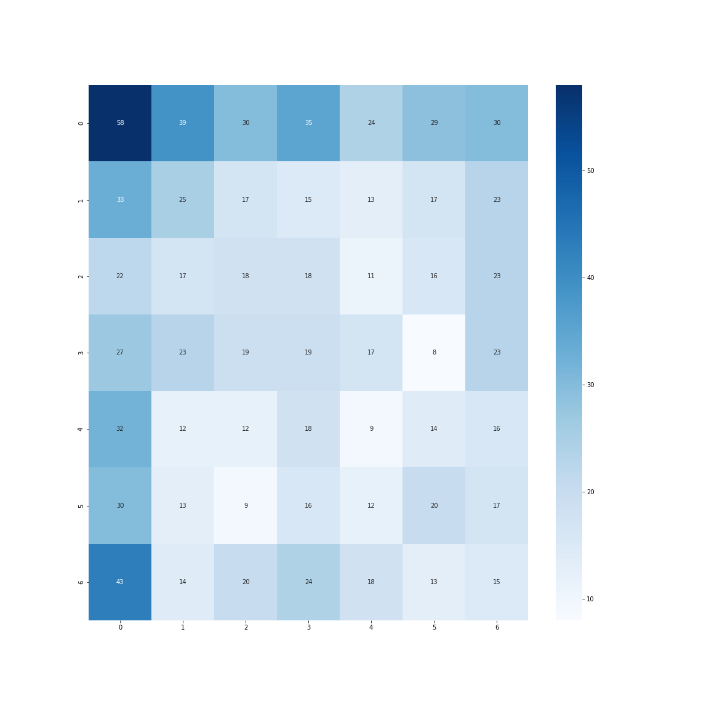

# Conclusions

All the 3 supervised learning that follows:
- Orange mission: binary classification
- Purple mission: multi-label (single class) classification
- Green mission: multi-label & multi-class classification

They have, at its core, a tensorflow-based implementation.
In fact, they both share almost the same data pipeline,
with data augmentation process, just adapted to the problem.

Besides, the backbone of the models are the same (or really 
similar in case of the CNNs built from scratch),
just adapted to the complexity of the data and the type
of classification.

### Relevant links
- [Orange mission: Kaggle notebook](https://www.kaggle.com/code/gerardcastro/eurecat-orange)
- [Purple mission: Kaggle notebook](https://www.kaggle.com/gcastro98dev/eurecat-purple)
- [Green mission: Kaggle notebook](https://www.kaggle.com/gerardcastro/eurecat-green) 

 ## Pretrained CNN: EfficientNet

After a time-consuming training with a pre-trained EfficientNet, 
the following results were sought:


It is interesting to see how the confusion matrix evolves in function
of the type of dataset, we have it for instance for the:
- Training set:

- Validation set:


Summarizing poor results were sought. This is even more clear when 
the summary is displayed:

```text
--------- TRAIN ---------
              precision    recall  f1-score   support

           0       0.24      0.24      0.24      3088
           1       0.12      0.12      0.12      1488
           2       0.13      0.13      0.13      1536
           3       0.15      0.15      0.15      1768
           4       0.11      0.11      0.11      1304
           5       0.14      0.14      0.14      1688
           6       0.11      0.11      0.11      1424
           7       0.00      0.00      0.00         8

    accuracy                           0.16     12304
   macro avg       0.13      0.13      0.13     12304
weighted avg       0.16      0.16      0.16     12304


--------- VALIDATION ---------
              precision    recall  f1-score   support

           0       0.24      0.24      0.24       245
           1       0.17      0.17      0.17       143
           2       0.14      0.14      0.14       125
           3       0.13      0.14      0.14       136
           4       0.09      0.08      0.08       113
           5       0.17      0.17      0.17       117
           6       0.10      0.10      0.10       147

    accuracy                           0.16      1026
   macro avg       0.15      0.15      0.15      1026
weighted avg       0.16      0.16      0.16      1026


--------- TEST ---------
              precision    recall  f1-score   support

           0       0.25      0.25      0.25       168
           1       0.10      0.10      0.10        71
           2       0.10      0.10      0.10        82
           3       0.15      0.16      0.15        95
           4       0.11      0.11      0.11        75
           5       0.14      0.14      0.14        74
           6       0.09      0.09      0.09        76
           8       0.00      0.00      0.00         1

    accuracy                           0.15       642
   macro avg       0.12      0.12      0.12       642
weighted avg       0.15      0.15      0.15       642
```

To be fair, more than a limitation of the model, I would arguably say it
is due to the lack of time to properly:
- Train it (low number of epochs set, stopped not because early stopping)
- Fine-tune it