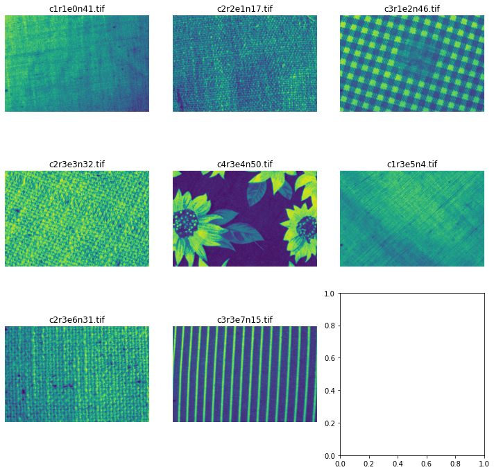
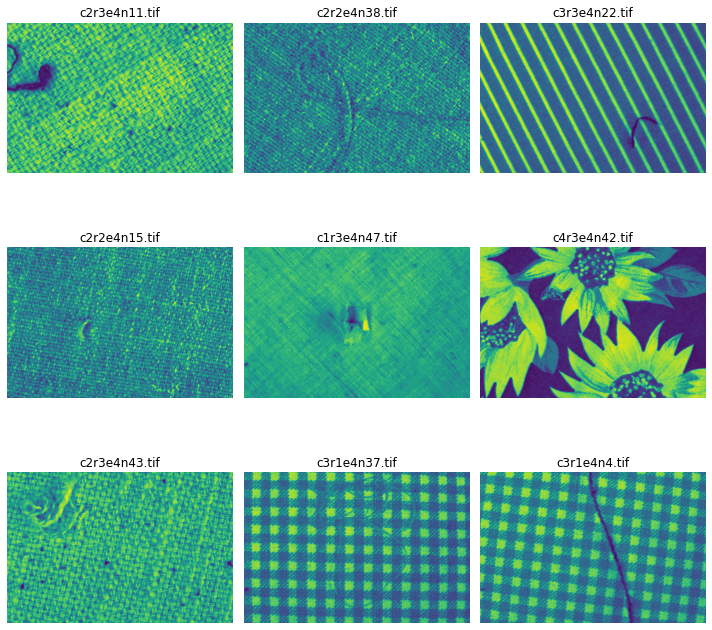
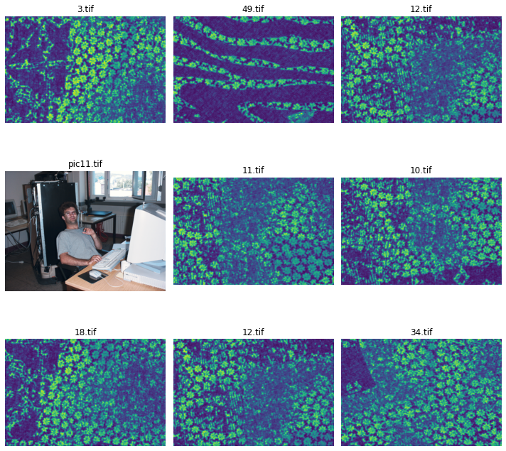

# Conclusions 

After an iterative process, it is seen:

- 'e0': no problem in the texture; denoted with class 0
- 'e1': hole; denoted with class 1
- 'e2': stain; denoted with class 2
- 'e3': defect in the thread; denoted with class 3
- 'e4': thread not belonging to the sample in the image; denoted with class 4
- 'e5': fold or crease; denoted with class 5
- 'e6': shadow or not enough light; denoted with class 6
- 'e7': camara problem (some images too near or far); denoted with class 7

- Also, the ones that do not fulfill these criteria are not labeled 
but most of them seems okay

## Line of thought

This is the result of the visualization of several samples. 
First a random search was carried out several times:

For example, a strong intuition arises when thinking 'e2' 
corresponds to a stain. 
Then, I confirmed my hypothesis plotting each pattern separately:

Which confirmed the hypothesis that 'e4' was nothing else than 
a random thread in the pattern; for instance. And, finally, 
I studied the case of the outliers, that is those
images whose name were not following any criteria. Except some
weird cases, most of them had no visible errors:

    