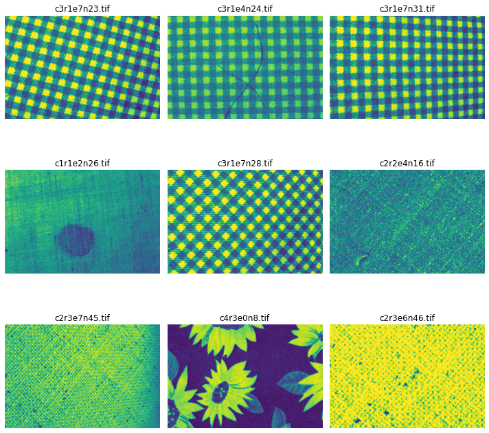
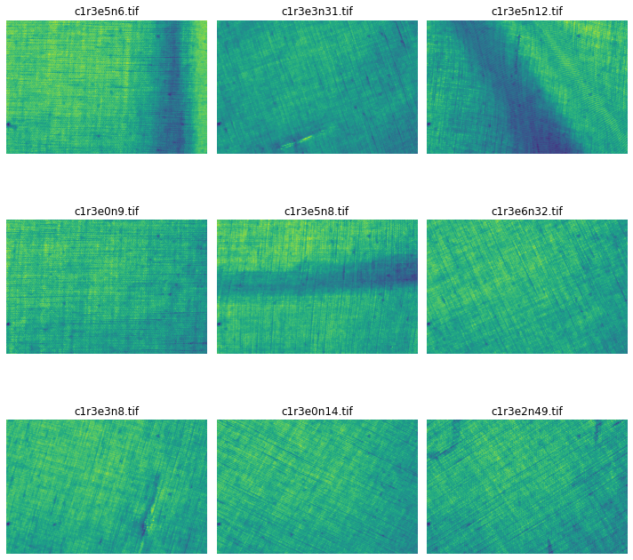
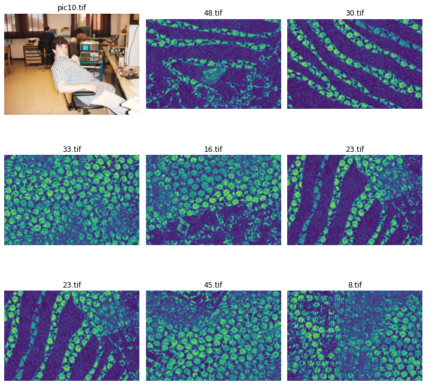

# Conclusions 

- 'c1r3' & 'c1r1': smooth textures with striation; denoted with class 1
- 'c2r3': crochet-like; ; denoted with class 2
- 'c2r2': denim; denoted with class 3
- 'c4r1': mosaic-like texture (small leaf-like shapes); denoted with class 4
- 'c4r3': tulips; denoted with class 5
- 'c3r3': wide parallel lines; denoted with class 6
- 'c3r1': squares; denoted with class 7

Also, as below is proved, the ones that do not fulfill these criteria are also mosaic-like (except 'pic10.tif' = 'guy in a desk' and 'test2.tif' = 'a rule'):
- 'pic10.tif': guy in a desk; class 8
- 'test2.tif': rule; class 9
- '< number >.tif': mosaic, class 4

## Line of thought

This is the result of the visualization of several samples. 
First a random search was carried out several times:

Then, I confirmed my hypothesis plotting each pattern separately:

And, finally, I studied the case of the outliers, that is those
images whose name were not following any criteria. Except some
weird cases, most of them were mosaic-like:

